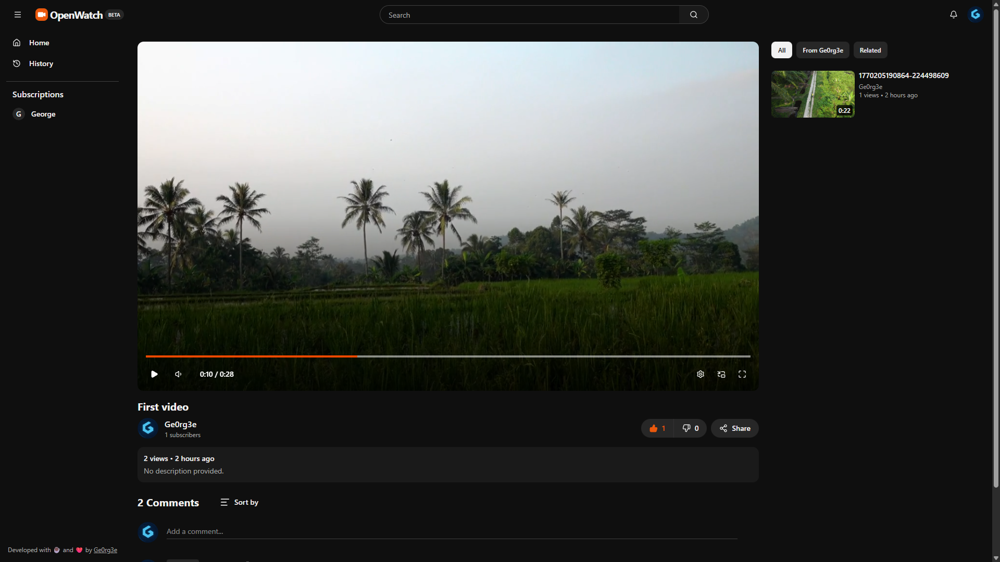

# OpenWatch (W.I.P)


An open-source alternative to YouTube, perfect for anyone wanting to store videos or content creators looking to back up their content on their own platform.



### Quick Start

```bash
curl -fsSL https://openwatch.ge0rg3e.rest/install.sh | sh
```

<details>
<summary>or use compose.yml file:</summary>

```yml
services:
    app:
        image: ghcr.io/openwatch-app/openwatch:latest
        container_name: openwatch
        restart: unless-stopped
        ports:
            - 8634:8634
        environment:
            - DATABASE_URL=postgres://postgres:{STRONG_PASSWORD}@db:5432/openwatch
            - NEXT_PUBLIC_BASE_URL=http://localhost:8634
            - AUTH_SECRET={STRONG_SECRET}
        volumes:
            - ./data/.storage:/app/.storage
        depends_on:
            - db

    db:
        image: postgres:16-alpine
        container_name: openwatch-db
        restart: unless-stopped
        ports:
            - 5432:5432
        environment:
            - POSTGRES_USER=postgres
            - POSTGRES_PASSWORD={STRONG_PASSWORD}
            - POSTGRES_DB=openwatch
        volumes:
            - postgres_data:/var/lib/postgresql/data

volumes:
postgres_data:
```

</details>

## Features

### Core Experience

- **Home Feed**: Personalized feed with filters (All, Recently uploaded, Watched)
- **Video Player**: Adaptive streaming with multiple quality support
- **Search**: Full-text search for videos and channels
- **History**: Watch history tracking with pause functionality
- **Playlists**: Create and manage personal playlists with visibility controls and autoplay support

### Interaction

- **Comments**: Nested replies, pinning, hearting, and like/dislike reactions
- **Reactions**: Like and Dislike videos
- **Subscriptions**: Subscribe to channels and customize notification settings
- **Notifications**: Real-time alerts for uploads, replies, and hearts with deep linking and management

### Creator Studio

- **Dashboard**: Overview of channel content and performance
- **Content Management**: Upload, edit, and manage videos
- **Customization**: Update channel banner, avatar, and description

### Admin Console

- **User Management**: Manage users and bans
- **System Settings**: Configure global application settings
- **Statistics**: Platform-wide metrics for users, videos, and engagement

## Tech Stack

- **Framework**: Next.js 16 (React 19)
- **Styling**: Tailwind CSS v4
- **Database**: PostgreSQL, Drizzle ORM
- **Video**: FFmpeg, HLS.js
- **State Management**: Zustand

## Development Setup

Follow these steps to set up the project locally for development:

#### Prerequisites

- Node.js (v20+ recommended)
- PostgreSQL database
- FFmpeg (installed locally)

#### Installation

1. **Clone the repository**:

    ```bash
    git clone https://github.com/openwatch-app/openwatch.git
    cd openwatch
    ```

2. **Install dependencies**:

    ```bash
    npm install
    ```

3. **Environment Setup**:
   Create a `.env` file in the root directory and configure your variables (Database URL, Auth secret, etc.).

#### Database Setup

```bash
# Generate migrations
npm run db:generate

# Push schema to database
npm run db:push
```

#### Running Development Server

```bash
npm run dev
```

The application will be available at `http://localhost:8634`.

## Scripts

- `npm run dev` - Start development server on port 8634
- `npm run build` - Build for production
- `npm run start` - Start production server
- `npm run db:studio` - Open Drizzle Studio to view database
- `npm run db:generate` - Generate database migrations
- `npm run db:push` - Push schema to database

## Contributing

We welcome contributions! Please check our [Contributing Guidelines](CONTRIBUTING.md) for details on how to report bugs, request features, and submit pull requests.

## License

See [LICENSE](LICENSE) for full details.

## Star History

[](https://www.star-history.com/#openwatch-app/openwatch&type=date&legend=top-left)
